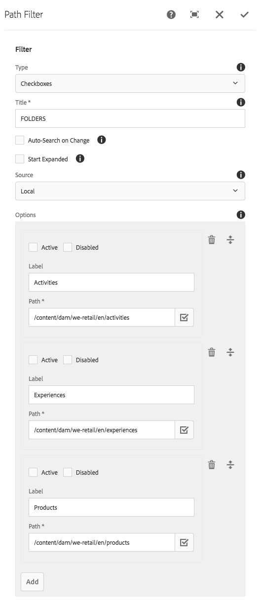

The Path Filter component displays controls that allow an end-user to refine search's based on sub-folders of assets stored in the DAM.

Note the paths configured by this filter **must** be equal

## Authoring

### Dialog / Filter
 
 
 
#### Type

The form controls to display for this filter.

  * Checkboxes _(Multi select)_
  * Radio buttons _(Single select)_
  * Slider _(Single select)_
  * Toggle _(Single select)_

#### Title

Label for the filter.

#### Auto-Search on Change

Select to automatically apply this filter via a new search when this filter's options change.

#### Start Expanded      
  
Select to initially render the component filter in an expanded mode, showing the selection options.

#### Source

Enumerates available filter options (ie. values)

  * Local
    * User-defined list of Labels and Path values
    * Path value is required. See below 
    * Active: Check to default this value to selected.
    * Disabled: Check to prevent users from changing this selection.          
  
  * Datasource
    * Sling resource type for the [Granite UI DataSource](https://docs.adobe.com/docs/en/aem/6-3/develop/ref/granite-ui/api/jcr_root/libs/granite/ui/docs/server/datasource.html) to populate the options.
    * This resource type is implemented and provided by the IT delivery team.
        
## Technical details

* **Component**: `/apps/asset-share-commons/components/search/path`
* **Sling Model**: `com.adobe.aem.commons.assetshare.search.predicates.impl.PathPredicateImpl.java`

This filter implements a wrapped version of AEM Query Builder's [JcrPropertyPredicateEvaluator](https://docs.adobe.com/docs/en/aem/6-3/develop/ref/javadoc/com/day/cq/search/eval/JcrPropertyPredicateEvaluator.html). 
The Asset Share Commons' provided predicate wrapper (`com.adobe.aem.commons.assetshare.search.impl.predicateevaluators.PropertyValuesPredicateEvaluator`) allows for the values to be provided as comma-delimited values to be transformed into `#_value` parameters for evaluation by AEM's JcrPropertyPredicateEvaluator; 

Example generated Query Builder predicate output: 

```
1_group.propertyvalues.property=./jcr:content/metadata/cq:tags
1_group.propertyvalues.operation=equals
1_group.propertyvalues.1_values=we-retail:activity/surfing
1_group.propertyvalues.2_values=we-retail:activity/swimming
```      


